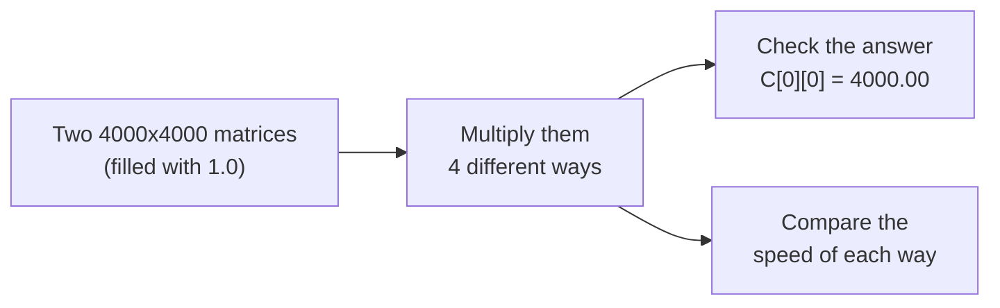

# Matrix Multiplication — 4 Ways (Simple Explanation)

This project multiplies two big **4000 × 4000** matrices using four different methods, and compares how fast each one is.

Both matrices only contain the number `1.0` in every cell. That means the answer is easy to check: every value in the result matrix should be **4000.00**. If the program prints that number, the math worked correctly.



---

## The four methods, in plain words

| # | Method | In one sentence |
|---|--------|------------------|
| 1 | **Sequential** | One CPU core does all the work, one step at a time. This is the slow, normal way — our baseline. |
| 2 | **OpenMP** | The same computer splits the work across **8 threads** that all share the same memory. |
| 3 | **MPI** | The work is split across **4 separate computers** (VMs) that talk to each other over the network. |
| 4 | **CUDA** | The work is handed to a **graphics card (GPU)**, which runs millions of tiny calculations at once. |

Think of it like cleaning a huge room:
- **Sequential** = one person cleaning the whole room alone.
- **OpenMP** = 8 people cleaning the same room together.
- **MPI** = the room is split into 4 sections, each cleaned by a different team in a different building, and they mail each other updates.
- **CUDA** = thousands of tiny robots each cleaning one square inch at the same time.

---

## How each one actually works

### 1. Sequential (the baseline)
One simple triple loop (`for i, for j, for k`) on one CPU core. No parallel work at all. This is the "before" picture we compare everything else to.

### 2. OpenMP (shared memory, one computer)
Adds a single line, `#pragma omp parallel for`, above the main loop. This tells the computer: "split these loop iterations across 8 CPU threads." All 8 threads can see the same matrices in memory, so there's no need to copy data around.

### 3. MPI (distributed memory, 4 computers)
Four separate Ubuntu virtual machines — one **Master** and three **Workers** — are connected on a network and given matching hostnames, SSH access, and Open MPI. Then:
1. **Scatter** – the Master splits Matrix A into 4 chunks (1000 rows each) and sends one chunk to each machine (`MPI_Scatter`).
2. **Broadcast** – Matrix B (the whole thing) is copied to all 4 machines, since every machine needs all of B (`MPI_Bcast`).
3. **Compute** – each machine multiplies its own 1000 rows, all at the same time.
4. **Gather** – the Master collects all 4 results back into one complete answer (`MPI_Gather`).

Because the 4 machines don't share memory, every piece of data has to be explicitly sent — that's what makes this "distributed."

### 4. CUDA (GPU, thousands of tiny workers)
The two matrices are copied from the computer's normal memory onto the GPU's memory. The GPU then launches **16 million threads** (one per output cell) arranged in a grid of blocks, and every thread computes its own value of the result **at the same time**. The finished matrix is copied back to the computer.

---

## Results — how fast was each one?

Matrix size for every method: **4000 × 4000**. Correct answer for every method: **C[0][0] = 4000.00**.

| Method | Time Taken | How Much Faster Than Sequential |
|---|---|---|
| Sequential (1 CPU core) | 244.12 seconds | 1× (starting point) |
| MPI (4 computers) | 92.98 seconds | ~2.6× faster |
| OpenMP (8 threads) | 30.83 seconds | ~7.9× faster |
| CUDA (GPU) | 0.165 seconds | ~1,479× faster |

### Chart — time taken and speed-up, side by side


### Chart — just the time taken


### Chart — just the speed-up


**In short:** the GPU (CUDA) wins by a huge margin, because it can run millions of tiny calculations at once. OpenMP comes second because sharing memory between 8 threads is very cheap. MPI is slower than OpenMP because sending matrix data between 4 separate computers over a network takes real time. Sequential is the slowest because it's just one core doing everything alone.

---

## Proof it actually ran (screenshots)

| What it shows | Screenshot |
|---|---|
| Sequential program finishing with the right answer |  |
| OpenMP using all 8 CPU threads (seen in `htop`) |  |
| The 4 MPI machines successfully pinging each other |  |
| A simple MPI message sent from one machine to another |  |
| The full MPI program finishing with the right answer |  |

---

## What's in this repo

```
├── src/
│   ├── sequential/matrix_sequential.c   # Method 1: one core, one thread
│   ├── openmp/matrix_openmp.c           # Method 2: 8 threads, shared memory
│   ├── mpi/matrix_mpi.c                 # Method 3: 4 machines, main program
│   ├── mpi/mpi_send_recv.c              # Method 3: simple test — send 1 number between machines
│   └── mpi/hosts                        # Method 3: list of the 4 machine names for MPI
│   └── cuda/matrix_cuda.cu              # Method 4: GPU program
├── images/                              # Screenshots + charts used in this README
├── scripts/generate_charts.py           # Script that draws the charts above
└── README.md                            # This file
```

---

## How to run each one yourself

### 1. Sequential
```bash
gcc matrix_sequential.c -o matrix_sequential
./matrix_sequential
```

### 2. OpenMP
```bash
gcc -fopenmp matrix_openmp.c -o matrix_openmp
./matrix_openmp
```

### 3. MPI (needs 4 machines already networked together with SSH + Open MPI installed on all of them)
```bash
# compile on the Master machine
mpicc matrix_mpi.c -o matrix_mpi

# copy the program to the other 3 machines
scp matrix_mpi worker1:~/
scp matrix_mpi worker2:~/
scp matrix_mpi worker3:~/

# run it across all 4 machines
mpirun -np 4 --hostfile hosts ./matrix_mpi
```

### 4. CUDA (needs an NVIDIA GPU + CUDA Toolkit installed)
```bash
nvcc matrix_cuda.cu -o matrix_cuda
./matrix_cuda
```

### Redraw the charts
```bash
pip install matplotlib numpy
python3 scripts/generate_charts.py
```

---

## Wrap-up

All four programs solve the exact same problem and all four give the exact same correct answer (`4000.00`). The only difference is **how the work is split up** — one core, many threads, many computers, or thousands of GPU threads — and that difference is what changes the speed from over 4 minutes down to under a fifth of a second.
