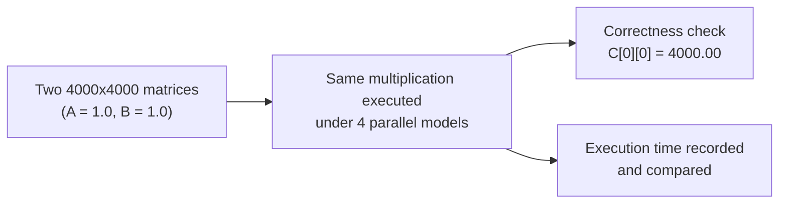
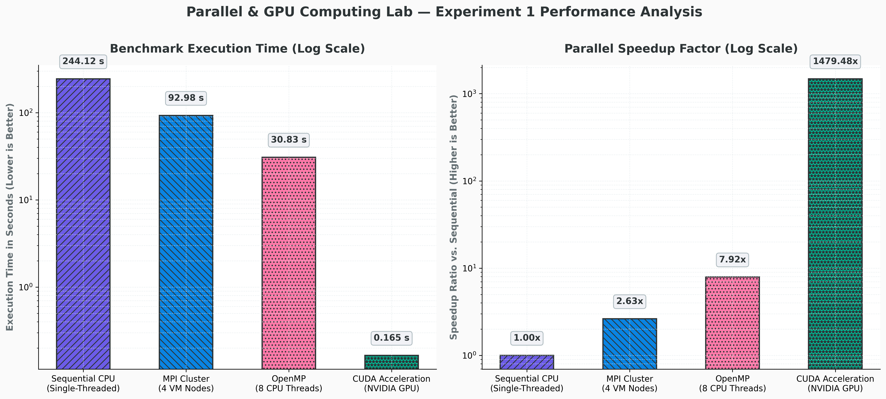
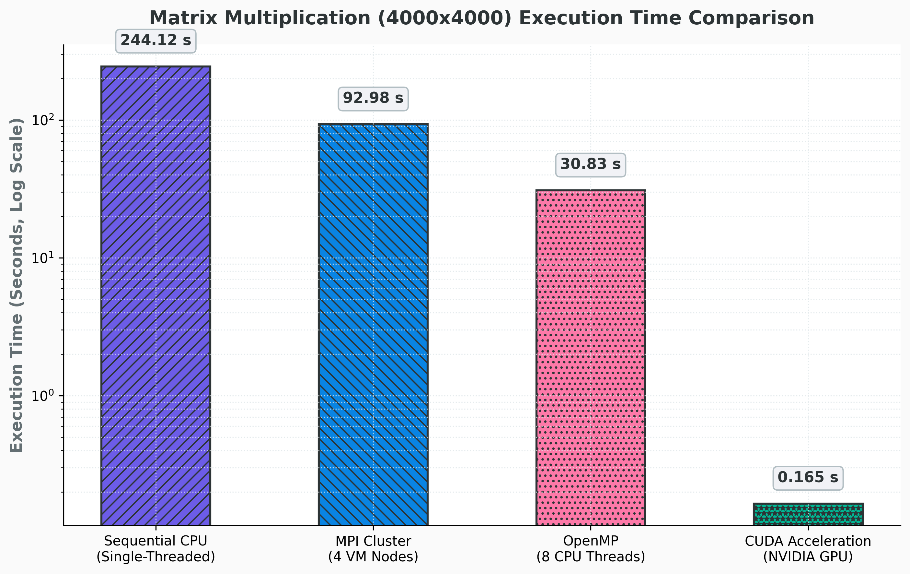
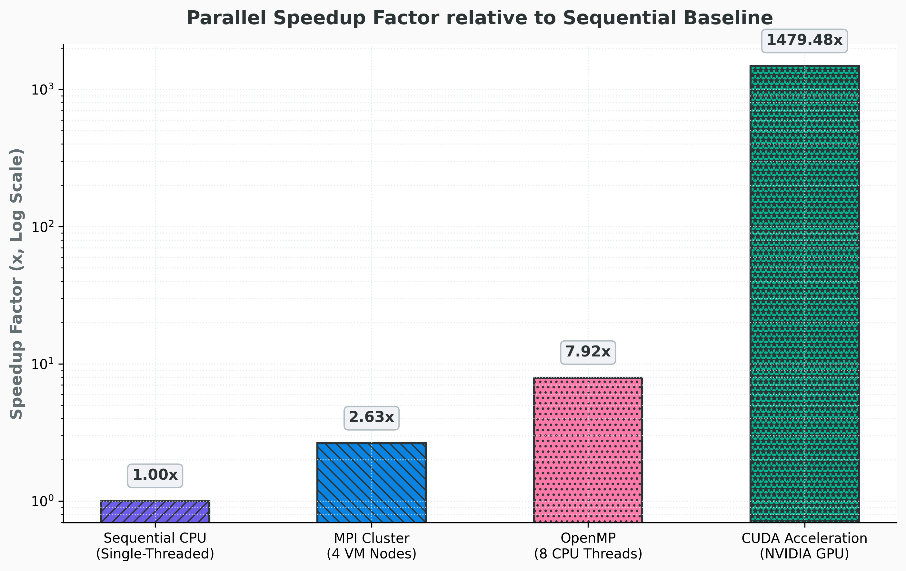
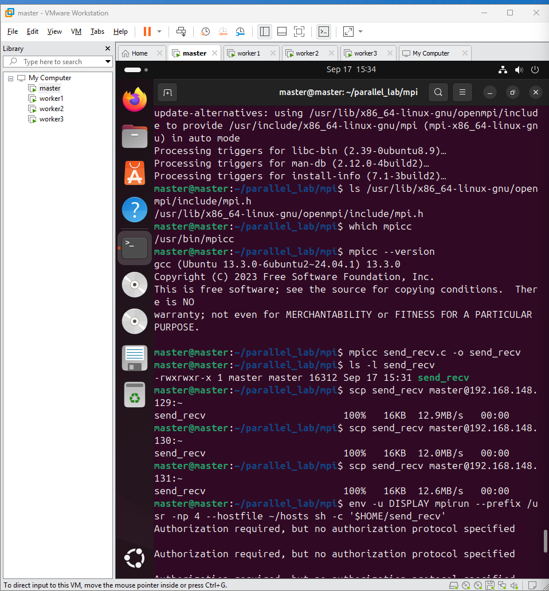

# Performance Analysis of Matrix Multiplication Across Parallel Computing Models

**Repository:** [PGC_LAB01](https://github.com/DivyaKumari29/PGC_LAB01)

## Overview

This repository presents an empirical performance study of dense matrix multiplication (`C = A × B`) on a **4000 × 4000** matrix pair, implemented and benchmarked across four distinct computing paradigms:

1. **Sequential** — single-core CPU execution (baseline)
2. **OpenMP** — shared-memory, multi-threaded CPU execution
3. **MPI** — distributed-memory execution across a networked cluster
4. **CUDA** — massively parallel GPU execution

The objective is to quantify the performance gains achieved when the same computational workload is migrated from a single CPU core to multi-core, multi-machine, and GPU-based execution environments.



## Objectives

- **Multi-model parallelization** — implement a uniform 4000 × 4000 matrix multiplication workload across Sequential, OpenMP, MPI, and CUDA.
- **Correctness verification** — use identical matrix initialization (`A[i][j] = 1.0`, `B[i][j] = 1.0`) across all implementations so that every result can be checked against the expected value `C[0][0] = 4000.00`.
- **Performance evaluation** — quantify the speedup obtained by moving from single-core execution to shared-memory (OpenMP), distributed-memory (MPI), and SIMT GPU (CUDA) execution.
- **Overhead analysis** — examine network communication latency in the MPI cluster and host-to-device / device-to-host memory transfer overhead in CUDA.

## Workload Specification

| Parameter | Value |
|---|---|
| Matrix dimension (N) | 4000 × 4000 |
| Matrix A | `A[i][j] = 1.0` for all i, j |
| Matrix B | `B[i][j] = 1.0` for all i, j |
| Operation | `C[i][j] = Σ (A[i][k] × B[k][j])`, k = 0 to N−1 |
| Expected verification value | `C[0][0] = 4000.00` |

## Computing Models

### 1. Sequential
A single-threaded, triple-nested loop (`O(N³)` complexity) running on one CPU core with no hardware concurrency. Used as the performance baseline.

### 2. OpenMP (Shared Memory)
The `#pragma omp parallel for` directive forks **8 worker threads** that share a single unified memory address space, dividing loop iterations dynamically across CPU cores. No explicit data copying is required between threads.

### 3. MPI (Distributed Memory)
Executed across **4 Ubuntu virtual machines** (one Master, three Workers) connected over a network, configured with matching hostnames, SSH access, and Open MPI:

1. **Scatter** — Matrix A is partitioned into 4 sub-blocks (1000 rows each) and distributed via `MPI_Scatter`.
2. **Broadcast** — Matrix B is duplicated in full to all ranks via `MPI_Bcast`.
3. **Compute** — each rank multiplies its assigned rows concurrently.
4. **Gather** — partial results are collected back into the complete matrix on the Master via `MPI_Gather`.

Since the ranks do not share memory, all data exchange is explicit — the defining property of the distributed-memory model.

### 4. CUDA (Massively Parallel SIMT)
Matrices A and B are transferred from host to device memory over PCIe. The kernel is launched across a 2D execution grid:

| Configuration | Value |
|---|---|
| Grid | 250 × 250 = 62,500 blocks |
| Block | 16 × 16 = 256 threads/block |
| Total logical GPU threads | 16,000,000 |

Each thread computes one output cell independently; the result matrix is then copied back to host memory.

## Results

All four models were executed on the same 4000 × 4000 workload and passed verification (`C[0][0] = 4000.00`).

| Model | Execution Time | Speedup vs. Sequential |
|---|---|---|
| Sequential (1 CPU core) | 244.12 s | 1× (baseline) |
| MPI (4 machines) | 92.98 s | ~2.6× |
| OpenMP (8 threads) | 30.83 s | ~7.9× |
| CUDA (GPU) | 0.165 s (0.146 s kernel) | ~1,479.5× |

CUDA additionally achieved a **~186.9× speedup** over the OpenMP implementation.

### Visualizations

| Chart | Preview |
|---|---|
| Execution time and speedup (combined) |  |
| Execution time only |  |
| Speedup only |  |

## Discussion

- **CUDA** delivered the largest performance gain by a wide margin, as it distributes the workload across millions of concurrent GPU threads.
- **OpenMP** performed second-best; sharing memory across 8 threads on a single machine introduces minimal overhead.
- **MPI** underperformed relative to OpenMP because inter-machine communication over the network (scatter/broadcast/gather) adds real, measurable latency.
- **Sequential** execution was the slowest, as the entire workload was processed by a single CPU core with no concurrency.

## Evidence of Execution

| Description | Screenshot |
|---|---|
| Sequential run completing with the correct result |  |
| OpenMP utilizing all 8 CPU threads (`htop`) |  |
| MPI cluster connectivity test (ping) |  |
| MPI point-to-point send/receive test |  |
| MPI program completing with the correct result |  |

## Repository Structure

```
├── src/
│   ├── sequential/matrix_sequential.c   # Model 1: single-core baseline
│   ├── openmp/matrix_openmp.c           # Model 2: 8-thread shared memory
│   ├── mpi/matrix_mpi.c                 # Model 3: 4-machine distributed program
│   ├── mpi/mpi_send_recv.c              # Model 3: point-to-point communication test
│   └── mpi/hosts                        # Model 3: MPI hostfile
│   └── cuda/matrix_cuda.cu              # Model 4: GPU kernel program
├── images/                              # Screenshots and charts referenced in this document
├── scripts/generate_charts.py           # Script used to generate the charts above
└── README.md                            # This document
```

## Source Code Reference

| Computing Paradigm | Source File | Description |
|---|---|---|
| Sequential CPU | [`src/sequential/matrix_sequential.c`](https://github.com/DivyaKumari29/PGC_LAB01/blob/main/src/sequential/matrix_sequential.c) | Baseline O(N³) triple-nested loop |
| OpenMP | [`src/openmp/matrix_openmp.c`](https://github.com/DivyaKumari29/PGC_LAB01/blob/main/src/openmp/matrix_openmp.c) | `#pragma omp parallel for` shared-memory multi-threading |
| MPI (Distributed) | [`src/mpi/matrix_mpi.c`](https://github.com/DivyaKumari29/PGC_LAB01/blob/main/src/mpi/matrix_mpi.c) | `MPI_Scatter`, `MPI_Bcast`, `MPI_Gather` distributed execution |
| MPI (Test) | [`src/mpi/mpi_send_recv.c`](https://github.com/DivyaKumari29/PGC_LAB01/blob/main/src/mpi/mpi_send_recv.c) | Point-to-point `MPI_Send` / `MPI_Recv` test |
| MPI Hostfile | [`src/mpi/hosts`](https://github.com/DivyaKumari29/PGC_LAB01/blob/main/src/mpi/hosts) | List of the 4 cluster machine names |
| CUDA GPU | [`src/cuda/matrix_cuda.cu`](https://github.com/DivyaKumari29/PGC_LAB01/blob/main/src/cuda/matrix_cuda.cu) | `matMulKernel<<<grid, block>>>` with 16 million GPU threads |
| Chart Generator | [`scripts/generate_charts.py`](https://github.com/DivyaKumari29/PGC_LAB01/blob/main/scripts/generate_charts.py) | Script used to produce the performance charts |

> **Note:** Links assume the default branch is named `main`. If the repository's default branch differs, replace `main` in the URLs above accordingly.

## Build and Run Instructions

### 1. Sequential
```bash
gcc matrix_sequential.c -o matrix_sequential
./matrix_sequential
```

### 2. OpenMP
```bash
gcc -fopenmp matrix_openmp.c -o matrix_openmp
./matrix_openmp
```

### 3. MPI
Requires 4 networked machines with SSH access and Open MPI pre-installed.
```bash
# Compile on the Master machine
mpicc matrix_mpi.c -o matrix_mpi

# Copy the compiled program to each Worker
scp matrix_mpi worker1:~/
scp matrix_mpi worker2:~/
scp matrix_mpi worker3:~/

# Run across all 4 machines
mpirun -np 4 --hostfile hosts ./matrix_mpi
```

### 4. CUDA
Requires an NVIDIA GPU and the CUDA Toolkit.
```bash
nvcc matrix_cuda.cu -o matrix_cuda
./matrix_cuda
```

### Regenerating the Charts
```bash
pip install matplotlib numpy
python3 scripts/generate_charts.py
```

## Conclusion

All four implementations solved the same matrix multiplication problem and produced the same verified result (`C[0][0] = 4000.00`). The sole variable across implementations was **how the workload was distributed** — one core, eight shared-memory threads, four networked machines, or sixteen million GPU threads — and this distribution strategy alone accounted for the difference in execution time, from over four minutes (Sequential) down to under a fifth of a second (CUDA).
