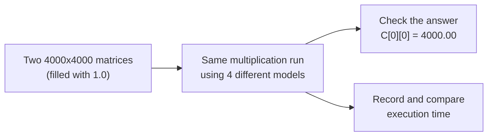

# Lab Report: Matrix Multiplication Using Multiple Models

## Aim
To multiply two large **4000 × 4000** matrices using four different computing models — Sequential, OpenMP, MPI, and CUDA — and compare how fast each model performs the same task.

## What was done
The same matrix multiplication problem (`C = A x B`) was solved four separate times, once with each model. In every case, Matrix A and Matrix B were filled entirely with `1.0`. This makes the correct answer easy to verify: every cell of the result matrix should equal **4000.00**. If a program prints that number, its calculation is correct.



---

## The four models used

| # | Model | What it means |
|---|--------|------------------|
| 1 | **Sequential** | One CPU core does the entire calculation, one step at a time. Used as the baseline to compare the rest against. |
| 2 | **OpenMP** | The same computer splits the work across **8 threads** that share one memory space. |
| 3 | **MPI** | The work is split across **4 separate machines** (VMs) that communicate over a network. |
| 4 | **CUDA** | The work is handed to a **GPU**, which runs millions of small calculations at the same time. |

---

## How each model works

### 1. Sequential Model
A simple triple loop (`for i, for j, for k`) runs on a single CPU core with no parallel execution. This gives the baseline execution time.

### 2. OpenMP Model
A single directive, `#pragma omp parallel for`, is placed above the main loop. This splits the loop's iterations across 8 CPU threads. Since all threads share the same memory, no data needs to be copied between them.

### 3. MPI Model
Four Ubuntu virtual machines — one **Master** and three **Workers** — were set up with matching hostnames, SSH access, and Open MPI. The program then:
1. **Scatters** Matrix A — the Master splits it into 4 chunks (1000 rows each) and sends one chunk to each machine (`MPI_Scatter`).
2. **Broadcasts** Matrix B — the full matrix is copied to all 4 machines, since every machine needs all of it (`MPI_Bcast`).
3. **Computes** — each machine multiplies its own 1000 rows at the same time as the others.
4. **Gathers** the results — the Master collects all 4 pieces back into one complete matrix (`MPI_Gather`).

Because the 4 machines do not share memory, every piece of data is passed explicitly between them. This is what makes it a "distributed" model.

### 4. CUDA Model
Matrix A and Matrix B are copied from normal computer memory onto the GPU's memory. The GPU then launches **16 million threads** (one per output cell), arranged into a grid of blocks, and every thread calculates its own result value at the same time. The finished matrix is copied back to the computer.

---

## Results

Matrix size for every model: **4000 × 4000**. Verification result for every model: **C[0][0] = 4000.00** (correct).

| Model | Execution Time | Speedup vs. Sequential |
|---|---|---|
| Sequential (1 CPU core) | 244.12 seconds | 1× (baseline) |
| MPI (4 machines) | 92.98 seconds | ~2.6× faster |
| OpenMP (8 threads) | 30.83 seconds | ~7.9× faster |
| CUDA (GPU) | 0.165 seconds | ~1,479× faster |

### Execution time and speedup, side by side


### Execution time only


### Speedup only


---

## Observation
The GPU (CUDA) finished fastest by a large margin, since it runs millions of small calculations in parallel hardware. OpenMP came next, because sharing memory between 8 threads on one machine has almost no extra cost. MPI was slower than OpenMP because sending matrix data between 4 separate machines over a network takes real time. The Sequential model was the slowest, since a single core had to do all the work alone.

---

## Proof of execution (screenshots)

| What it shows | Screenshot |
|---|---|
| Sequential program finishing with the correct result |  |
| OpenMP using all 8 CPU threads (seen in `htop`) |  |
| The 4 MPI machines successfully pinging each other |  |
| A test message sent from one MPI machine to another |  |
| The full MPI program finishing with the correct result |  |

---

## Repository contents

```
├── src/
│   ├── sequential/matrix_sequential.c   # Model 1: one core, one thread
│   ├── openmp/matrix_openmp.c           # Model 2: 8 threads, shared memory
│   ├── mpi/matrix_mpi.c                 # Model 3: 4-machine main program
│   ├── mpi/mpi_send_recv.c              # Model 3: basic test - send 1 number between machines
│   └── mpi/hosts                        # Model 3: list of the 4 machine names for MPI
│   └── cuda/matrix_cuda.cu              # Model 4: GPU program
├── images/                              # Screenshots and charts referenced in this report
├── scripts/generate_charts.py           # Script used to draw the charts above
└── README.md                            # This report
```

---

## How to run each model

### 1. Sequential
```bash
gcc matrix_sequential.c -o matrix_sequential
./matrix_sequential
```

### 2. OpenMP
```bash
gcc -fopenmp matrix_openmp.c -o matrix_openmp
./matrix_openmp
```

### 3. MPI (requires 4 networked machines with SSH + Open MPI already installed)
```bash
# compile on the Master machine
mpicc matrix_mpi.c -o matrix_mpi

# copy the program to the other 3 machines
scp matrix_mpi worker1:~/
scp matrix_mpi worker2:~/
scp matrix_mpi worker3:~/

# run it across all 4 machines
mpirun -np 4 --hostfile hosts ./matrix_mpi
```

### 4. CUDA (requires an NVIDIA GPU + CUDA Toolkit)
```bash
nvcc matrix_cuda.cu -o matrix_cuda
./matrix_cuda
```

### Regenerate the charts
```bash
pip install matplotlib numpy
python3 scripts/generate_charts.py
```

---

## Conclusion
All four models solved the same matrix multiplication problem and produced the same correct result (`4000.00`). The difference between them was purely in **how the work was divided** — one core, many threads on one machine, many separate machines, or thousands of GPU threads — and that difference is what changed the execution time from over 4 minutes down to under a fifth of a second.
