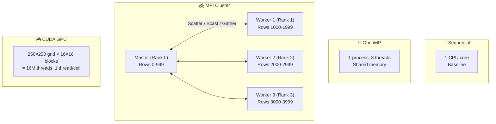
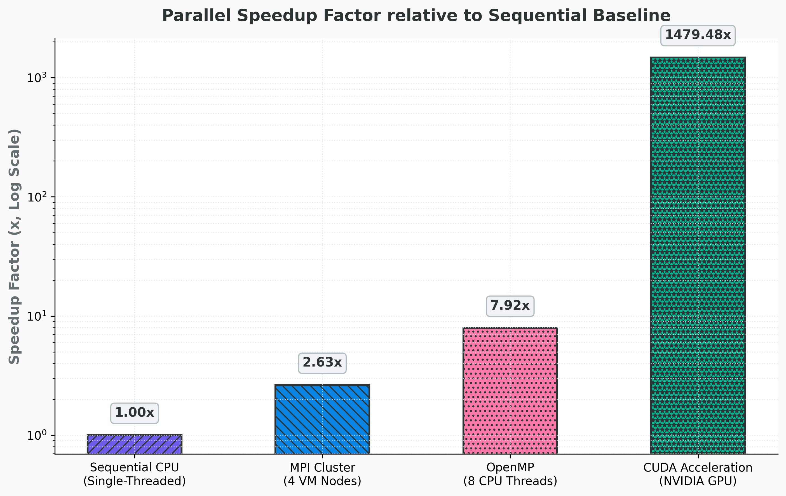

<div align="center">

#  Parallel and GPU Computing Lab
## Matrix Multiplication — Sequential vs OpenMP vs MPI vs CUDA


</div>

---

## 

| Item | Details |
|---|---|
| Experiment | 4000 × 4000 matrix multiplication across 4 parallel programming models |
| Models compared | Sequential (baseline) · OpenMP (shared memory) · MPI (distributed memory) · CUDA (GPU) |
| MPI cluster | 1 Master VM + 3 Worker VMs (Ubuntu 24.04, Open MPI 4.1.6) |
| Verification value | `C[0][0] = 4000.00` on every run, every model |
| Best speedup | **1479.48×** (CUDA vs Sequential) |

---

## Table of Contents

1. [Aim](#1-aim)
2. [Objectives](#2-objectives)
3. [System Architecture](#3-system-architecture)
4. [Theory](#4-theory)
5. [Requirements](#5-requirements)
6. [Problem Statement](#6-problem-statement)
7. [Procedure and Execution Steps](#7-procedure-and-execution-steps)
8. [Expected Output](#8-expected-output)
9. [Results and Graphs](#9-results-and-graphs)
10. [Observations](#10-observations)
11. [Screenshots of Execution](#11-screenshots-of-execution)
12. [Troubleshooting](#12-troubleshooting)
13. [Learning Outcomes](#13-learning-outcomes)
14. [Result](#14-result)
15. [Conclusion](#15-conclusion)
16. [Repository Structure](#16-repository-structure)

---

## 1. Aim

To multiply two large 4000 × 4000 matrices using four different computing models — **Sequential**, **OpenMP**, **MPI**, and **CUDA** — and to compare their execution time, speedup, and efficiency.

## 2. Objectives

1. Write a sequential matrix multiplication program and record its execution time as the baseline.
2. Parallelize the program with OpenMP and run it on 8 threads.
3. Build a 4-node Ubuntu VM cluster and run the program using MPI.
4. Accelerate the program on an NVIDIA GPU using CUDA.
5. Verify that every model produces the correct result (`4000.00`).
6. Compare speedup and efficiency of each parallel model against the sequential baseline.

## 3. System Architecture


```mermaid
flowchart TB
    subgraph Sequential["🧵 Sequential"]
        S1["1 CPU core<br/>Baseline"]
    end

    subgraph OpenMP["🔀 OpenMP"]
        O1["1 process, 8 threads<br/>Shared memory"]
    end

    subgraph MPI["🖧 MPI Cluster"]
        M0["Master (Rank 0)<br/>Rows 0-999"]
        M1["Worker 1 (Rank 1)<br/>Rows 1000-1999"]
        M2["Worker 2 (Rank 2)<br/>Rows 2000-2999"]
        M3["Worker 3 (Rank 3)<br/>Rows 3000-3999"]
        M0 <-->|Scatter / Bcast / Gather| M1
        M0 <--> M2
        M0 <--> M3
    end

    subgraph CUDA["🎮 CUDA GPU"]
        C1["250×250 grid × 16×16 blocks<br/>= 16M threads, 1 thread/cell"]
    end
```

**MPI Cluster Topology**

| Node | Hostname | IP Address | MPI Rank | Rows of A |
|---|---|---|---|---|
| Master | master | 192.168.125.128 | 0 | 0 – 999 |
| Worker 1 | worker1 | 192.168.125.129 | 1 | 1000 – 1999 |
| Worker 2 | worker2 | 192.168.125.130 | 2 | 2000 – 2999 |
| Worker 3 | worker3 | 192.168.125.131 | 3 | 3000 – 3999 |

## 4. Theory

| Model | Memory Model | Parallel Unit | Communication |
|---|---|---|---|
| **Sequential** | Single address space | 1 core | None — baseline |
| **OpenMP** | Shared memory | Threads (same machine) | Implicit, via shared variables |
| **MPI** | Distributed memory | Processes (across machines) | Explicit, via messages |
| **CUDA** | Host + device memory | Thousands of GPU threads | Host↔device memory copy |

**Sequential** — One CPU core does all the work, one step at a time. Used as the baseline for every speedup calculation.

**OpenMP** — A single program forks multiple threads on the same machine. Since all threads share the same memory space, no explicit data transfer is needed — the `#pragma omp parallel for` directive alone is enough to divide the row-wise work.

**MPI (Message Passing Interface)** — The program runs as several independent processes, each with its own private memory, potentially on different physical or virtual machines. Data must be explicitly exchanged using MPI calls:

| MPI Function | Purpose |
|---|---|
| `MPI_Init` / `MPI_Finalize` | Start and stop the MPI environment |
| `MPI_Comm_rank` / `MPI_Comm_size` | Get a process's ID and the total process count |
| `MPI_Send` / `MPI_Recv` | Point-to-point message between two processes |
| `MPI_Scatter` | Split Matrix A and distribute one chunk per process |
| `MPI_Bcast` | Broadcast the full Matrix B to every process |
| `MPI_Gather` | Collect all partial results into the final Matrix C |
| `MPI_Barrier` | Synchronize all processes at a point |
| `MPI_Wtime` | High-resolution wall-clock timing |

**CUDA** — Work is offloaded to an NVIDIA GPU, which executes thousands of lightweight threads concurrently. Here, each GPU thread computes exactly one cell of the result matrix, exploiting massive data parallelism that CPUs simply don't have the core count for.

## 5. Requirements

**Software**

| Software | Used For |
|---|---|
| Ubuntu 24.04 LTS | Operating system for all VMs |
| GCC | Compiling the Sequential and OpenMP programs |
| Open MPI 4.1.6 (`mpicc`, `mpirun`) | Compiling and running the MPI program |
| OpenSSH Server | Passwordless remote access between MPI nodes |
| NVIDIA CUDA Toolkit (`nvcc`) | Compiling the CUDA program |
| VMware | Provisioning the 4-node MPI cluster |
| Python 3 + matplotlib + numpy | Plotting performance charts |

**Hardware (recommended minimum)**

| Component | Recommendation |
|---|---|
| CPU | 4+ cores (8+ for a fair OpenMP comparison) |
| RAM | 8 GB+ per VM (4000×4000 double matrices ≈ 128 MB each) |
| GPU | Any CUDA-capable NVIDIA GPU (compute capability ≥ 5.0) |
| Network | VMs on the same virtual/private subnet |

## 6. Problem Statement

Calculate `C = A × B`, where A, B, and C are all 4000 × 4000 matrices, and every element of A and B is initialized to `1.0`.

Each element of C is therefore the sum of 4000 products of `1 × 1`, so **every** cell of the correct result is `4000`. The program prints `C[0][0]` as a lightweight correctness check without needing to dump the entire 16-million-element matrix.

---

## 7. Procedure and Execution Steps

All source files live inside the `src/` folder.

### 7.1 Sequential Model
```bash
cd src/sequential
gcc matrix_sequential.c -o matrix_sequential
./matrix_sequential
```
Note the execution time and confirm `C[0][0] = 4000.00`.

### 7.2 OpenMP Model
```bash
cd src/openmp
gcc -fopenmp matrix_openmp.c -o matrix_openmp
export OMP_NUM_THREADS=8
./matrix_openmp
```
*(Optional)* Watch `htop` in another terminal while it runs to see all 8 threads light up.

### 7.3 MPI Model (4 Virtual Machines)

**Part A — Prepare the cluster**

1. **Set hostnames** on each VM:
   ```bash
   sudo hostnamectl set-hostname master     # Master VM only
   sudo hostnamectl set-hostname worker1    # Worker 1 only
   sudo hostnamectl set-hostname worker2    # Worker 2 only
   sudo hostnamectl set-hostname worker3    # Worker 3 only
   hostname                                 # verify on every VM
   ```
2. **Find each VM's IP:** `hostname -I`
3. **Test connectivity** from the Master (expect `0% packet loss`):
   ```bash
   ping -c 4 192.168.125.129
   ping -c 4 192.168.125.130
   ping -c 4 192.168.125.131
   ```
4. **Install and start SSH** on every Worker:
   ```bash
   sudo apt update
   sudo apt install openssh-server -y
   sudo systemctl enable --now ssh
   sudo systemctl status ssh        # should show: active (running)
   ```
5. **Set up passwordless SSH** from the Master:
   ```bash
   ssh-keygen -t rsa
   ssh-copy-id worker1@worker1
   ssh-copy-id worker1@worker2
   ssh-copy-id worker1@worker3
   ```
6. **Add SSH host aliases** on the Master (`~/.ssh/config`):
   ```
   Host worker1
       HostName worker1
       User worker1
   Host worker2
       HostName worker2
       User worker1
   Host worker3
       HostName worker3
       User worker1
   ```
   ```bash
   chmod 600 ~/.ssh/config
   ssh worker1 hostname     # should print worker1
   ssh worker2 hostname     # should print worker2
   ssh worker3 hostname     # should print worker3
   ```
7. **Install Open MPI** on all 4 VMs:
   ```bash
   sudo apt update
   sudo apt install openmpi-bin libopenmpi-dev -y
   mpirun --version
   mpicc --version
   ```
8. **Create the hostfile** on the Master (also included at `src/mpi/hosts`):
   ```
   master slots=1
   worker1 slots=1
   worker2 slots=1
   worker3 slots=1
   ```
9. **Smoke-test the cluster:**
   ```bash
   mpirun -np 4 --hostfile hosts hostname
   ```
   All four hostnames must appear (order doesn't matter).

**Part B — Test message passing**
```bash
cd src/mpi
mpicc mpi_send_recv.c -o mpi_send_recv
scp mpi_send_recv worker1:~/
scp mpi_send_recv worker2:~/
scp mpi_send_recv worker3:~/
env -u DISPLAY mpirun -np 4 --hostfile hosts sh -c '$HOME/mpi_send_recv'
```

**Part C — Run the matrix multiplication**
```bash
mpicc matrix_mpi.c -o matrix_mpi
scp matrix_mpi worker1:~/
scp matrix_mpi worker2:~/
scp matrix_mpi worker3:~/
ssh worker1 "ls -l ~/matrix_mpi"
ssh worker2 "ls -l ~/matrix_mpi"
ssh worker3 "ls -l ~/matrix_mpi"
env -u DISPLAY mpirun -np 4 --hostfile hosts sh -c '$HOME/matrix_mpi'
```

**How the MPI program works**
1. Rank 0 creates the full Matrix A and Matrix B.
2. `MPI_Scatter` distributes 1000 rows of A to each of the 4 ranks.
3. `MPI_Bcast` sends the full Matrix B to every rank.
4. Each rank multiplies its own 1000 rows concurrently.
5. `MPI_Gather` collects the partial results back into the full Matrix C on Rank 0.
6. Rank 0 prints the total time and the verification value.

### 7.4 CUDA Model
```bash
nvidia-smi
nvcc --version
cd src/cuda
nvcc matrix_cuda.cu -o matrix_cuda
./matrix_cuda
```
Matrices A and B are copied to GPU memory, the kernel launches a 250×250 grid of 16×16 thread blocks (16 million threads total, one per output cell), and the result is copied back to host memory.

### 7.5 Generate the Charts
```bash
pip install matplotlib numpy
python3 scripts/generate_charts.py
```
Charts are saved into the `images/` folder.

---

## 8. Expected Output

**MPI program**
```
Initializing 4000 x 4000 matrices...
Rank 0 on master computing 1000 rows
Rank 1 on worker1 computing 1000 rows
Rank 2 on worker2 computing 1000 rows
Rank 3 on worker3 computing 1000 rows

MPI Matrix Multiplication Completed
Matrix Size = 4000 x 4000
Number of MPI Processes = 4
Execution Time = 92.979510 seconds
Verification C[0][0] = 4000.00
```

**MPI send/receive test**
```
Rank 0 is running on master
Rank 0 on master: Sending A = 10 to Rank 1
Rank 1 is running on worker1
Rank 2 is running on worker2
Rank 3 is running on worker3
Rank 1 on worker1: Received A = 10 from Rank 0
```

For Sequential, OpenMP, and CUDA, the final line is always:
```
Verification C[0][0] = 4000.00
```

---

## 9. Results and Graphs

| Model | Configuration | Execution Time | Speedup | Efficiency |
|---|---|---:|---:|---:|
| Sequential | 1 CPU core | 244.12 s | 1.00× | — |
| MPI | 4 VMs, 4 ranks | 92.98 s | 2.63× | ~65.6% |
| OpenMP | 8 threads | 30.83 s | 7.92× | ~99% |
| **CUDA** | **NVIDIA GPU** | **0.165 s** | **1479.48×** | — |

**Formulas used**
```
Speedup    = Sequential Time / Parallel Time
Efficiency = Speedup / Number of processes (or threads)

MPI speedup    = 244.12 / 92.98 = 2.63
MPI efficiency = 2.63 / 4       = 65.6%
```

**Execution time and speedup (log scale)**


**Execution time**


**Speedup**



## 10. Observations

1. All four models produced the correct value `C[0][0] = 4000.00`, confirming implementation correctness across every model.
2. **CUDA was the fastest by a huge margin** — the GPU executes thousands of threads simultaneously, each handling one output cell.
3. **OpenMP came in second.** Its 8 threads share memory directly, so there is virtually no communication overhead.
4. **MPI beat Sequential but trailed OpenMP.** It has to serialize and transmit large matrices between processes, and it only used 4 processes vs. OpenMP's 8 threads.
5. All 4 MPI "virtual machines" ran on the same physical host, sharing one CPU and one memory system — this is why MPI's speedup falls short of what dedicated separate machines would achieve.
6. For statistically sound comparisons, each program should be run multiple times and the results averaged to smooth out system noise.

## 11. Screenshots of Execution

| Screenshot | What it shows |
|---|---|
|  | Sequential program output and timing |
|  | `htop` showing all 8 OpenMP threads active |
|  | Connectivity check between MPI nodes |
|  | `MPI_Send` / `MPI_Recv` test across the cluster |
|  | Full MPI matrix multiplication run |
| 


## 12. Troubleshooting

| Symptom | Likely Cause | Fix |
|---|---|---|
| `mpirun` hangs with no output | SSH between nodes needs a password | Re-run `ssh-copy-id` for every worker; test with `ssh worker1 hostname` |
| `Permission denied (publickey)` | `~/.ssh/config` user/host mismatch | Confirm the `User` field matches the actual account name on each worker |
| MPI program runs but crashes on workers | Executable not copied to worker's home directory | Re-run the `scp` step; VMs do **not** share a filesystem |
| `nvcc: command not found` | CUDA Toolkit not on `$PATH` | Add `/usr/local/cuda/bin` to `PATH` in `~/.bashrc` |
| OpenMP shows no speedup | `OMP_NUM_THREADS` not exported, or VM has < 8 vCPUs | `echo $OMP_NUM_THREADS`; check `nproc` |
| CUDA program returns wrong `C[0][0]` | Grid/block dimensions mis-sized for 4000×4000 | Verify grid = ⌈4000/16⌉ × ⌈4000/16⌉ = 250×250 |

## 13. Learning Outcomes

By completing this lab, you should be able to:

- Explain the difference between **shared-memory** (OpenMP) and **distributed-memory** (MPI) parallelism.
- Configure a multi-node Linux cluster with passwordless SSH and a working MPI hostfile.
- Use core MPI collective operations (`Scatter`, `Bcast`, `Gather`) to distribute and recombine work.
- Write a basic CUDA kernel and reason about grid/block/thread indexing.
- Compute and interpret **speedup** and **parallel efficiency**, and explain why real-world efficiency falls short of theoretical (Amdahl's Law) limits.
- Choose the right parallel model for a given hardware setup and problem size.

## 14. Result

Matrix multiplication of two 4000 × 4000 matrices was performed using Sequential, OpenMP, MPI, and CUDA models. Every model produced the correct value `C[0][0] = 4000.00`. Execution times were **244.12 s** (Sequential), **92.98 s** (MPI), **30.83 s** (OpenMP), and **0.165 s** (CUDA).

## 15. Conclusion

The same computational problem was solved four different ways, with only the strategy for dividing the work changing between them. Sequential execution was, unsurprisingly, the slowest. MPI reduced execution time by distributing work across 4 virtual machines, but network communication overhead and shared underlying hardware limited its practical speedup. OpenMP performed significantly better since its threads share memory directly with no serialization cost. CUDA delivered the best result by far, harnessing thousands of concurrent GPU threads to process the matrix almost instantaneously. This experiment demonstrates clearly that **the choice of parallel computing model has a dramatic impact on performance**, and that model choice should be driven by the target hardware and the nature of the workload.

---

## 16. Repository Structure

```
PGC_LAB01/
├── README.md                           This lab report
├── .gitignore                          Files Git should ignore
├── src/
│   ├── sequential/
│   │   └── matrix_sequential.c         Sequential program
│   ├── openmp/
│   │   └── matrix_openmp.c             OpenMP program (8 threads)
│   ├── mpi/
│   │   ├── matrix_mpi.c                MPI matrix multiplication program
│   │   ├── mpi_send_recv.c             MPI send/receive test program
│   │   └── hosts                       MPI hostfile (4 machines)
│   └── cuda/
│       └── matrix_cuda.cu              CUDA GPU program
├── images/                             Charts and execution screenshots
│   ├── performance_comparison_charts.png
│   ├── execution_time_chart.png
│   ├── speedup_chart.png
│   ├── sequential_result.png
│   ├── openmp_htop.png
│   ├── mpi_ping.png
│   ├── mpi_send_recv.png
│   ├── mpi_result.png
│   └── cuda_result.png
└── scripts/
    └── generate_charts.py              Generates the performance charts
```

## 17. Documentation Notes

- Every program prints its own execution time and the verification value `C[0][0]`.
- Timing methods used: `clock()` for Sequential, `omp_get_wtime()` for OpenMP, `MPI_Wtime()` for MPI, and CUDA events for CUDA.
- MPI's reported time includes data distribution, broadcast, computation, gathering, and synchronization — not just raw compute time.
- MPI executables must be present in the home directory of **every** VM, since the VMs do not share a filesystem.
- The MPI hostfile must be referenced from the folder that contains the `hosts` file, or with its correct relative/absolute path.

## 18. How to Upload to GitHub
 
1. Go to **github.com** → click **+** → **New repository**.
2. Give it a name → click **Create repository**.
3. Click **Add file → Upload files**.
4. Drag in `README.md`, `.gitignore`, and the `images`, `results`, `screenshots` folders.
5. Click **Commit changes**.

</div>
